# Notice d'utilisation - PDI 18
## Application Web pour l’Aménagement des Voies Cyclables à Paris

## 1. PAGE D'ACCUEIL
Lorsque vous démarrez le serveur Apache avec *MAMP*, pour accéder à l'application, il vous suffit d'entrer [localhost](http://localhost/) dans la barre d'adresse de n'importe quel navigateur. Cela vous redirigera vers la page d'accueil de l'application, qui est nommée *Accueil - SAFELANE*.

<p align="center">
  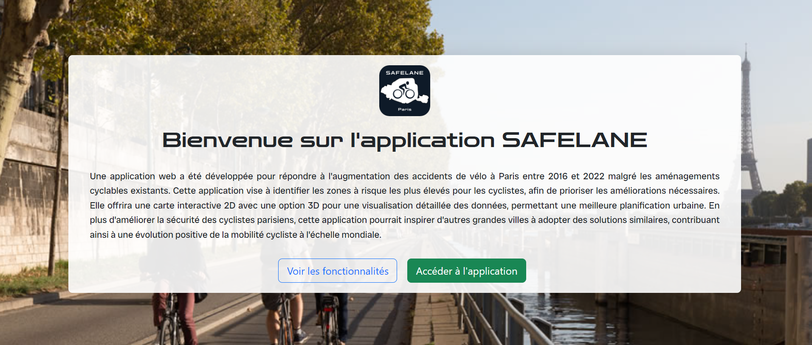
</p>

Une fois sur la page d'accueil de l'application, vous trouverez une description de celle-ci accompagnée de deux boutons :
  1. Le premier bouton ouvre une fenêtre contextuelle (popup) affichant les fonctionnalités de l'application.

<p align="center">
  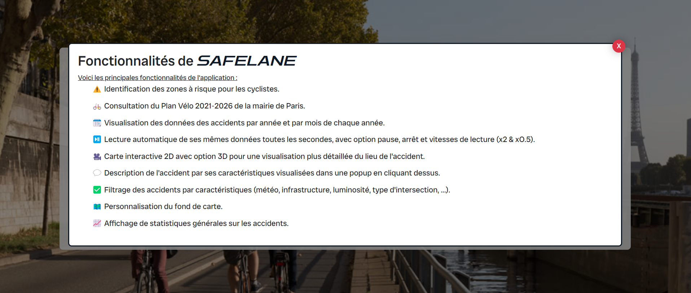
</p>

  3. Le second bouton vous permet d'accéder directement à l'application elle-même, c'est-à-dire à la carte ou à l'interface principale.

## 2. PAGE DE L'APPLICATION

Initialement, la carte affiche un fond gris clair basique pour une lisibilité optimale. Tous les accidents survenus entre 2016 et 2022 sont visibles par défaut, comme indiqué sous le curseur temporel. Ce dernier permet de filtrer les données par année : en le déplaçant, vous pouvez voir les accidents pour une année spécifique. Pour réinitialiser et afficher *toutes les années*, il suffit d'utiliser le bouton du même nom.

### 2.1. CURSEUR
En activant l'option *Curseur par mois*, vous pouvez filtrer les accidents par mois, couvrant la période de janvier 2016 à décembre 2022. Le curseur temporel peut également être lancé en lecture automatique pour visualiser les données qui défilent dans le temps. Lorsque vous appuyez sur le bouton *Play*, d'autres commandes deviennent disponibles :
<p align="center">
  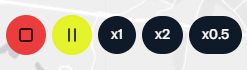
</p>
- Le bouton *Stop* réinitialise les données pour afficher toutes les années.
- Le bouton *Pause* arrête le défilement automatique à la dernière date visualisée.
- Les boutons de vitesse (*x1*, *x2* et *x0.5*) permettent de régler la vitesse de défilement des accidents pour une visualisation plus rapide ou plus lente.

### 2.2. AUTRES ACTIONS DIRECTES
En haut à gauche de l'application, vous trouverez :
<p align="center">
  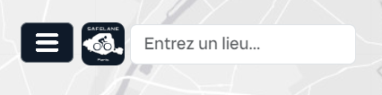
</p>
- Un bouton pour accéder aux autres fonctionnalités dans le menu latéral.
- Le logo de l'application, qui vous ramène à la page d'accueil lorsque vous cliquez dessus.
- Une barre de recherche vous permettant de zoomer sur une adresse spécifique sur la carte.

### 2.3. PANNEAU LATÉRAL
Dans le panneau latéral, vous trouverez les fonctionnalités suivantes :
  1. **Filtrer les accidents selon deux critères différents**.
<p align="center">
  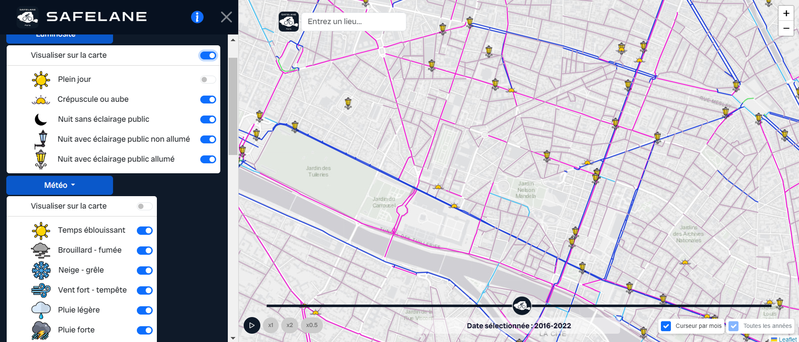
</p>
  2. **Visualiser les accidents avec la légende des types d'attributs**.
<p align="center">
  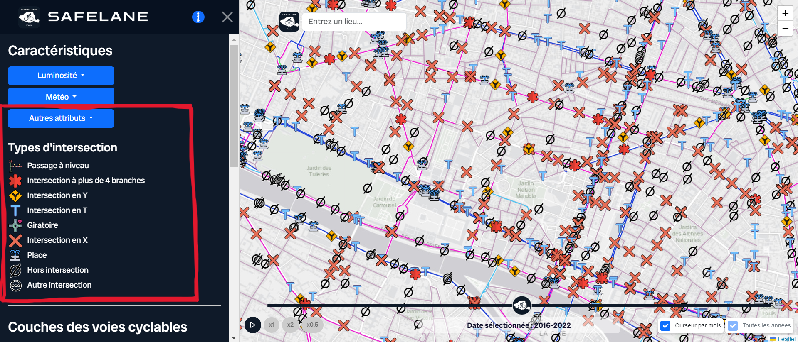
</p>
  3. **Afficher ou masquer le plan vélo Paris 2021-2026**.
<p align="center">
  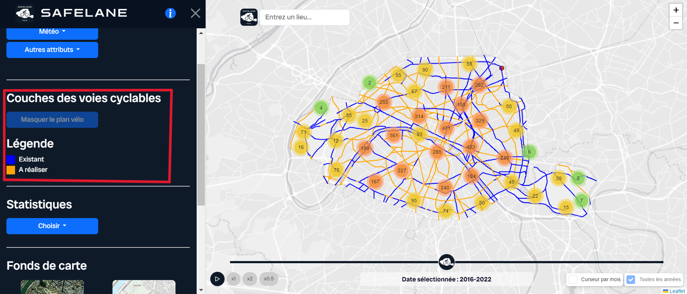
</p>
  4. **Consulter des statistiques générales sur les accidents**.
<p align="center">
  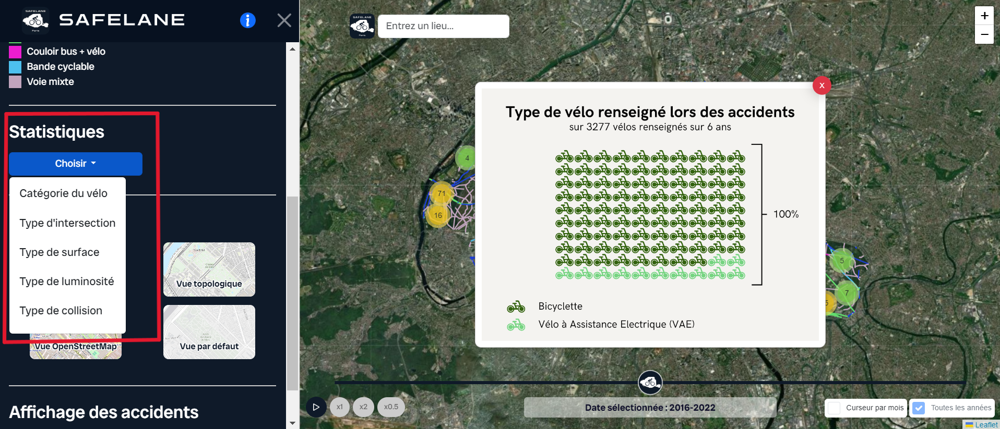
</p>
  5. **Changer le fond de carte** (par exemple : topologique, satellite, OpenStreetMap) ou le remettre par défaut.
<p align="center">
  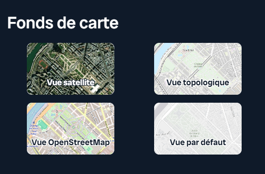
</p>
  6. **Masquer les accidents pour mieux visualiser les pistes**.
<p align="center">
  
</p>

### 2.4. INFORMATIONS ACCIDENTS
Enfin, une fonctionnalité essentielle consiste à consulter les informations détaillées de chaque point représentant un accident. En cliquant sur un point, une fenêtre contextuelle s'affiche avec toutes les informations relatives à l'accident, mettant en avant la date principale. Deux boutons sont alors disponibles :
- Un bouton pour *zoomer sur* l'emplacement de l'accident sur la carte en 2D.
- Un autre bouton permettant de *visualiser le lieu de l'accident en 3D*, offrant ainsi une perspective plus immersive.

<p align="center">
  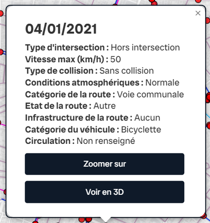
</p>

### 2.5. VUE 3D
La fonctionnalité d'immersion 3D est essentielle dans l'application, permettant une meilleure visualisation du lieu de l'accident et des aménagements environnants. L'accident est représenté par un marqueur rouge dans cette vue 3D afin de le localiser facilement. En haut de la page, un bouton *Retour* est disponible pour revenir à la page principale de l'application, où toutes les fonctionnalités sont accessibles.

<p align="center">
  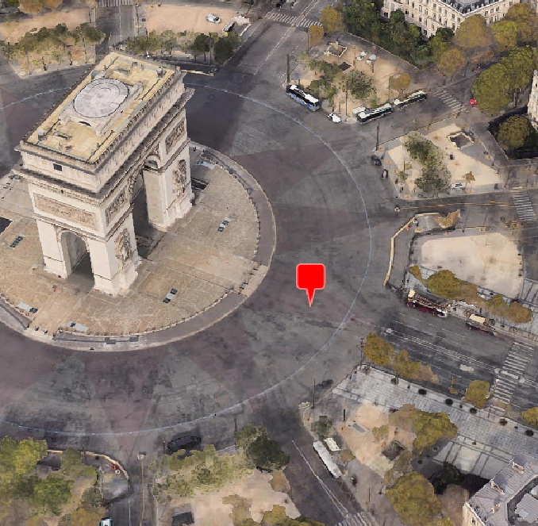
</p>

Maintenant que vous êtes familiarisé avec toutes les fonctionnalités, vous êtes libre de visualiser les données selon les critères qui vous intéressent.

Profitez pleinement de l'application SAFELANE ! En espérant une prise en main facile et efficace.

```
- Thomas WITTMER : chef de projet et développeur
- Jeanne BOUNAN : analyste des besoins et développeur
- Laure GREGOIRE : analyste SIG, responsable qualité et développeur
- Johan PALOS : analyste SIG et développeur

ING2 2023-2024
```
