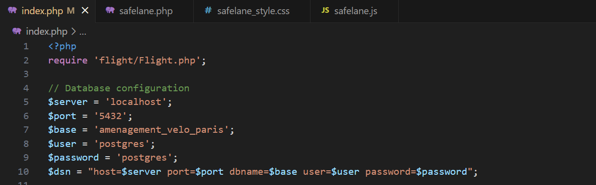
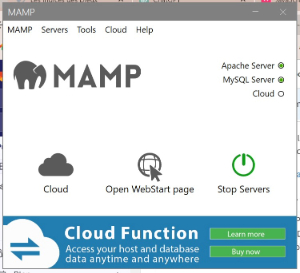

# Notice d'installation - PDI 18
## Application Web pour l’Aménagement des Voies Cyclables à Paris

Le but du projet est de créer une application Web-SIG sur laquelle nous pouvons visualiser les accidents de vélo ainsi que les aménagements cyclables présents dans la ville de Paris. De nombreuses fonctionnalités sont présentes dans l'application pour une prise en main des données facile. Le plan vélo Paris 2021-2026 et un mode de visualisation 3D sont au coeur de l'application afin d'identifier si des aménagements sont présents ou non. Et voici le logo réalisé par nos soins pour que l'application est une identité à part entière : *SAFELANE*.

<p align="center">
  
</p>

Ce projet est commandité par l’entreprise française [Coexya](https://www.coexya.eu/) à Paris, par l’intermédiaire de Mathieu Cattin, architecte et responsable technique de la cellule SIG, et de Gabin Jubault, ingénieur d'études.

<p align="center">
  
</p>

Ceci est le tutoriel d'installation pour obtenir en local (sur votre ordinateur) l'application Web-SIG. Un tutoriel d'utilisation de l'application est disponible sur ce git s'appellant *README-USE.md*.

## Sommaire
1. [INSTALLATION PGADMIN](#installation-pgadmin)
2. [MISE EN PLACE DE LA BASE DE DONNEES](#mise-en-place-des-donnees)
3. [LANCEMENT DE L'APPLICATION](#lancement-application)


## 1. INSTALLATION PGADMIN
- Installez pgAdmin4 via le lien internet suivant :
   * [pgAdmin 4 v8.6](https://www.pgadmin.org/download/pgadmin-4-windows/) : Version 8.6

- Lors de l'installation, dans le StackBuilder, installez deux extensions :
	- dans Database Servers, installez PostgreSQL (dernière version)
	- dans Spatial Extensions, installez PostGIS (dernière version)

- Puis créez un nom d'utilisateur et un mot de passe adéquat (par exemple : username = postgres & password = postgres).


## 2. MISE EN PLACE DE LA BASE DE DONNEES
Pour mettre en place la base de données de toute l'application, il faudra bien évidemment lancer le logiciel *pgAdmin4* :
- Lancez le logiciel, se connecter avec les identifiants choisis lors de la configuration.
- Créez une base de données (clic droit sur Databases --> Create --> Database) et la nommer *amenagement_velo_paris*.
- Installez l'extension PostGIS : clic droit sur Extensions --> Create --> Extension --> taper *postgis* dans la barre de recherche.
- Importez la base de données : clic droit sur la database *amenagement_velo_paris* --> [Restore](#restore) --> Filename --> choisir le fichier fourni *new_backup_amenagement_velo_paris.backup*, ce backup se trouve dans le fichier Data sur ce github.


## LANCEMENT DE L'APPLICATION
- Désormais, pour pouvoir lancer l'application en local, il va vous falloir télécharger un autre logiciel, celui-ci se nomme *MAMP*. Il nous sert à lancer l'application en local sans nécessité de connexion internet grâce au serveur Apache :
   * [MAMP - Windows Installer](https://www.mamp.info/en/downloads/) : Version 5.0.5

- Avant de lancer l'application, il est nécessaire de se connecter à la base de données via le code et une modification est à faire. La modification est à faire dans le code *index.php*, il faudra renseigner vos identifiants de connexion ($user et $password) de *pgAdmin4*. Voici le code :

<p align="center">
  
</p>

- Puis, pour se connecter à une base de données postgres en PHP, il vous faut d’abord le configurer :
   - dans le fichier *php.ini*, décommentez les lignes (enlever le point-virgule) chargeant les extensions, notamment *extension=php_pgsql.dll*
   - dans le fichier *httpd.conf* (Apache), chargez la librairie dynamique avec *LoadFile*, c'est une ligne de code à insérer --> *LoadFile "C:/MAMP/bin/ php/php8.0.1/libpq.dll"* (exemple avec *MAMP*, vérifiez bien le dossier de votre version de PHP)
   - redémarrez le serveur Apache avec *MAMP*.

- Une dernière manipulation est nécessaire avant de pouvoir lancer l'application.

<p align="center">
  
</p>

- Cliquez sur l'onglet *MAMP* en haut à gauche --> puis sur *Preferences* --> et *Server* --> un chemin de fichier vous est demandé dans la section *Document Root* et vous indiquez l'endroit sur votre ordinateur où vous avez stocké les données du jeu. Par exemple, *C:\PDI18\WebApp_Cycle_Paths*. Toutes les données du jeu sont dans le fichier *WebApp_Cycle_Paths* sur ce github.

- Puis vous pouvez enfin lancer l'application, il n'y a qu'à écrire [localhost](http://localhost/) dans votre barre de recherche de n'importe quel navigateur et vous serez redirigé sur la page d'accueil de l'application = *Accueil - SAFELANE*.

```
- Thomas WITTMER : chef de projet et développeur
- Jeanne BOUNAN : analyste des besoins et développeur
- Laure GREGOIRE : analyste SIG, responsable qualité et développeur
- Johan PALOS : analyste SIG et développeur

ING2 2023-2024
```
